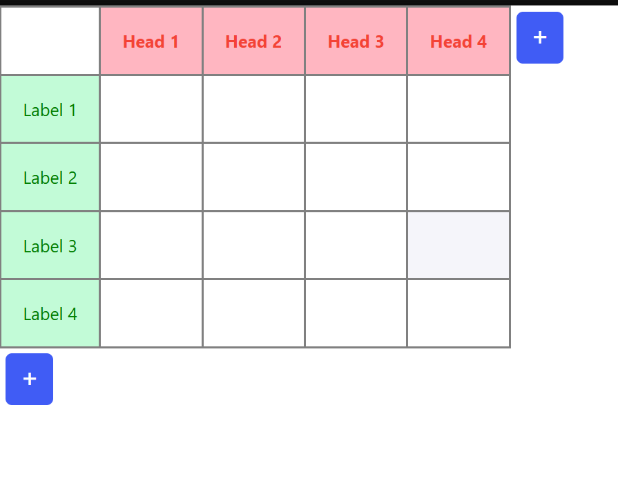

# Spreadsheet Like Data-grid

A spreadsheet-like DataGrid build using React (no third-party libraries) that supports editing, adding rows/columns, mouse drag selection, copy & paste of rectangular ranges, and automatically extends the grid if the pasted area would overflow

## 🚀 Features:
- Add new columns and row using Add Column/Add Button.
- 2 Diementional selection to cut,copy and paste
- Dynamic Column and Row insertion while pasting 
- Can able to copy & paste the Excel data's directly
- Keyboard navigation between cells

## 📦 Prerequisites:

- Node.js installed.

## Common Technologies Used:

- React JS
- HTML
- CSS

## ⚡Steps To Run The App Locally:

1. Go to the github repo `https://github.com/VengadeshRaj/spreadsheet-like-data-grid`
2. Clone the app using `git clone https://github.com/VengadeshRaj/spreadsheet-like-data-grid.git`
3. Go to the root of the folder
4. Run `npm i` to install node modules
5. Run `npm run start` to start the app
6. Visit localhost:3000 in the browser.